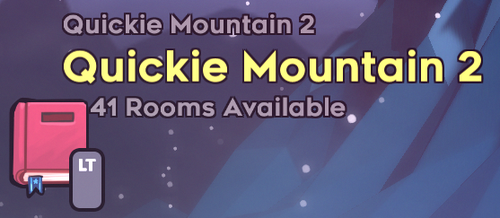

Quickie Mountain 2 Celeste Randomizer
==========================

This is a collection of randomizer configuration files and routing descriptions for the [Quickie Mountain 2 pack](https://gamebanana.com/maps/214450) of maps for [Celeste](http://www.celestegame.com/). 

The config is designed to be compatible with the [Celeste Randomizer](https://github.com/rhelmot/CelesteRandomizer).

For the best experience, it is recommended to play the pack first before playing the randomizer add-on.

Installation
------------
Running mods with Celeste requires you to have installed [Everest](https://everestapi.github.io/).

1. Download the [QM2 pack](https://gamebanana.com/maps/214450).
2. Download the [Celeste Randomizer](https://gamebanana.com/tools/6848).
3. The config is included by default and the Collab levels will be available in the randomizer level select screen.

Difficulty Modes
----------------
The difficulties are intended to be equivalent to the vanilla randomizer difficulties, which are defined [here](https://github.com/rhelmot/CelesteRandomizer#difficulty-modes). The ratings are based on difficulty of execution and assume that you have played QM2 before. If you haven't, some screens may be harder than the ratings imply. The current difficulty ratings for each screen and other information on routing can be found in the documentation [here](docs/routing). If you find new routes or would like to suggest tweaks or changes to difficulty ratings, feel free to contact me!

Choosing a difficulty means any room can be included that is at that difficulty or lower. Most rooms are Hard or Normal.

Known Issues / Planned Additions
--------------------------------
1. This config is recently released and may still have softlocks or misconfigurations.
2. Secret rooms that do not have gameplay in them were mostly removed to avoid a surplus of empty rooms. If you think one should be added back in or one that was kept should be taken out, let me know.
3. There are not many rooms, and very few reverse routes, which means maps may be hard or impossible to generate depending on your settings. If you run into this issue, include levels from other packs in your pool.
4. Some songs are not yet included due to issues with progression.

Contact
-------

If you encounter any issues/softlocks or have suggestions, you can reach me on Discord (Bigkahuna#0491) or ping me in the #randomizer channel in the main [Celeste Discord](https://discord.gg/celeste). To minimize issues, use the latest version of the config and the randomizer mod. Please include randomizer version, seed, and settings in any bug reports.

Credits
-------

**Creator**: Bigkahuna

**QM2 Support**:
* frozenflygone
* BeanJammin

**Randomizer Support**:
* Rhelmot